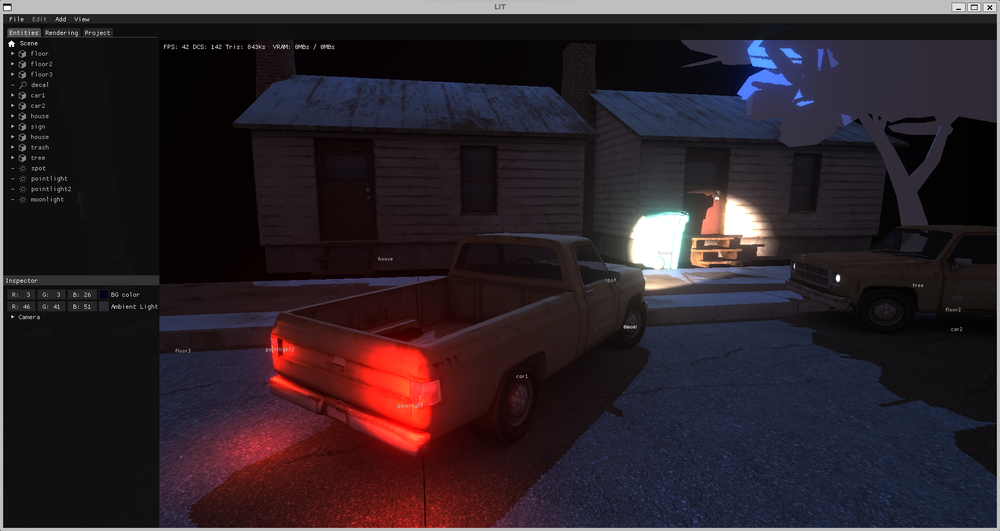

# LitEngine
OpenGL C++ Framework used for small projects.
It is meant to make easy to code C++ games but giving you freedom. Doesnt impose much.



It has basic features with a clean API:
- Math stuff: vec3, Mat4, Quaternion
- Classes for GPU stuff: Texture, Mesh, Shader and FBO
- Classes for Scene: Camera, Node, Scene, Prefab 
- SceneGraph with renderer and editor
- Parsers for OBJ, GLTF, PNG, JPG, TGA, KTX, DDS
- Ray-Mesh, Ray-Scene and Sphere-Scene collision.
- Support for Animated Characters using custom format.
- Other useful classes to wrap Threads, Scripts in JS.
- ImGUI integrated
- Visual Studio 2019 Project and Makefile + XCode project
- Based in SDL2 and OpenGL 3.1

Missing:
- Physics
- Path Finding
- Audio
- Network

## Compile

### Windows
Open the solution in the Visual Studio folder using Visual Studio 2019.

### OSX
Open the XCode solution

### Linux

to install libraries
```sh
apt-get install libsdl2-dev
apt-get install libglew-dev
```

and to compile
```sh
make
```


## Others

Similar projects:
 - [mgp](https://github.com/chunquedong/mgp)
 - [3Dev](https://github.com/1Kuso4ek1/3Dev)
